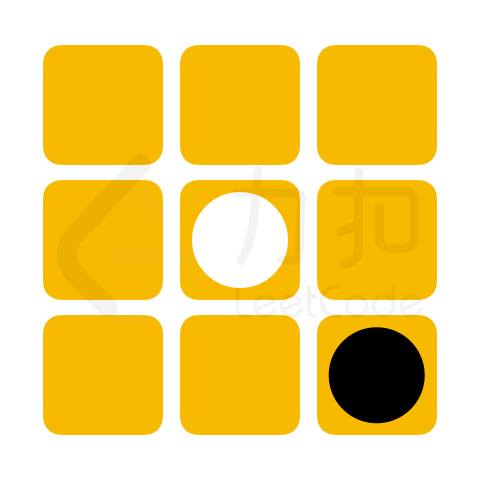

## 这次比赛本周重在参与的态度，提前准备不多，没想到最后成绩还比去年高。

废话不多说放成绩，今年的战绩：

## 接下来讲解下ac的题目


由于篇幅有限只提供题目，忽略用例,所有解答代码见[note](/notes/leetcode/2021-fail-contest/)


### [1. 无人机方阵](https://leetcode-cn.com/contest/season/2021-fall/problems/0jQkd0/)

> 在 「力扣挑战赛」 开幕式的压轴节目 「无人机方阵」中，每一架无人机展示一种灯光颜色。 无人机方阵通过两种操作进行颜色图案变换：
  1 调整无人机的位置布局
  2 切换无人机展示的灯光颜色
给定两个大小均为 `N*M` 的二维数组 `source` 和 `target` 表示无人机方阵表演的两种颜色图案，由于无人机切换灯光颜色的耗能很大，请返回从 `source` 到 `target` 最少需要多少架无人机切换灯光颜色。

> 注意： 调整无人机的位置布局时无人机的位置可以随意变动。


这道签到题比春季赛的简单，由于位置可以随意调换，我们可以用两个hash分别存储已有的颜色和需要的颜色的数量， 需要的颜色-已有的颜色之和就是答案了。


### [2. 心算挑战](https://leetcode-cn.com/contest/season/2021-fall/problems/uOAnQW/)

> 「力扣挑战赛」心算项目的挑战比赛中，要求选手从 `N`张卡牌中选出 `cnt` 张卡牌，若这 `cnt` 张卡牌数字总和为偶数，则选手成绩「`有效`」且得分为 `cnt` 张卡牌数字总和。
给定数组 `cards` 和 `cnt`，其中 cards[i] 表示第 `i` 张卡牌上的数字。 请帮参赛选手计算最大的有效得分。若不存在获取有效得分的卡牌方案，则返回 0。


显然该题适用贪心算法，我们先观察条件，分数之和必须是偶数，所以我们的卡牌只能由偶数个奇数和任意个偶数组成。
首先我们把卡牌分成奇数和偶数，再分别进行排序。 我们考虑每两张奇数卡牌之和和两张偶数卡牌之和，取其最大的组合，这样我们就能保证我们取的卡牌是分数且为偶数，如果遇到卡牌不足的情况则说明不存在满足条件的情况则返回0。


PS：如果需要去的卡牌为奇数说明必又一个偶数，我们先将最大的偶数加入结果，这样需要的卡牌数就能保证是偶数。


### [3. 黑白翻转棋](https://leetcode-cn.com/contest/season/2021-fall/problems/fHi6rV/)

> 在 n*m 大小的棋盘中，有黑白两种棋子，黑棋记作字母 "X", 白棋记作字母 "O"，空余位置记作 "."。当落下的棋子与其他相同颜色的棋子在行、列或对角线完全包围（中间不存在空白位置）另一种颜色的棋子，则可以翻转这些棋子的颜色。

{{}}
{{}}
{{}}

> 「力扣挑战赛」黑白翻转棋项目中，将提供给选手一个未形成可翻转棋子的棋盘残局，其状态记作 chessboard。若下一步可放置一枚黑棋，请问选手最多能翻转多少枚白棋。

> 注意：
> 若翻转白棋成黑棋后，棋盘上仍存在可以翻转的白棋，将可以 继续 翻转白棋
> 输入数据保证初始棋盘状态无可以翻转的棋子且存在空余位置


本题没有啥技巧，由于数据量不打枚举各个空格的情况即可，编码可优化，详见代码。


### [4. 玩具套圈](https://leetcode-cn.com/contest/season/2021-fall/problems/vFjcfV/)
> 「力扣挑战赛」场地外，小力组织了一个套玩具的游戏。所有的玩具摆在平地上，`toys[i]` 以 `[xi,yi,ri]` 的形式记录了第 `i` 个玩具的坐标 `(xi,yi)` 和半径 `ri`。小扣试玩了一下，他扔了若干个半径均为 `r` 的圈，`circles[j]` 记录了第 `j` 个圈的坐标 `(xj,yj)`。套圈的规则如下：
  - 若一个玩具被某个圈完整覆盖了（即玩具的任意部分均在圈内或者圈上），则该玩具被套中。
  - 若一个玩具被多个圈同时套中，最终仅计算为套中一个玩具
> 请帮助小扣计算，他成功套中了多少玩具。

> 注意：
> 输入数据保证任意两个玩具的圆心不会重合，但玩具之间可能存在重叠。


如果玩具的半径大于圈的半径肯定不符合，顾我们只需考虑小于圈的半径的玩具，如果一个玩具一个玩具的判断复杂度是 O(10^8) 肯定会超时，顾我们需要优化，换个角度我们考虑每个玩具会被哪个圈包含，由于圈的半径是固定的，我们可以对圈进行排序，二分法判断从哪个圈开始于该玩具接触，当玩具的最左点小于圈的最左点时表示该玩具无法被任何圈包含则进行下一个玩具的判断。
那如何判断一个小圆`半径为r 坐标为(x,y)`在另一个圆的`半径为R 坐标为(X,Y)`中呢？其实只需要判断圆心之间的距离+小圆的半径<= 大圆的半径即可：
$$ \sqrt{(X-x)^2 + (Y-y)^2}  + r < R  $$
$$\downdownarrows $$
$$ \sqrt{(X-x)^2 + (Y-y)^2}   < R-r $$
$$ \downdownarrows $$
$$ (X-x)^2 + (Y-y)^2   < (R-r)^2 $$



---

### 总结

比起春季赛进步还是很大的，自己也没想到能做出四道题（第四道题还是有点投机取巧，如果用例想故意卡我还是很容易的），下次要注意不要自暴自弃式提交，这次`wa`了8次！！！
还是要多多复习[oi-wiki](https://oi-wiki.org/)的内容。团队赛加油💪。


