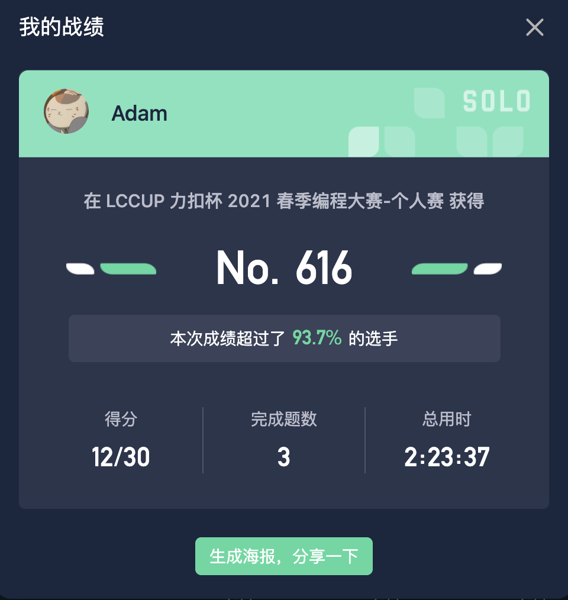
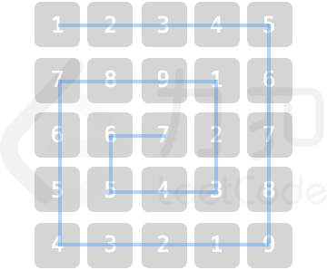

## 赛前立个flag，做出~~四~~三道题

比起去年还是进步了， 去年就做了两道题，败在了[dp](https://leetcode-cn.com/problems/UlBDOe/) 上。
今年的战绩：

## 接下来讲解下ac的题目


由于篇幅有限只提供题目，忽略用例,所有解答代码见[note](/notes/leetcode/2021-spring-contest/)


### [1.采购方案](https://leetcode-cn.com/problems/4xy4Wx/)

> 小力将 N 个零件的报价存于数组 nums。小力预算为 target，假定小力仅购买两个零件，要求购买零件的花费不超过预算，请问他有多少种采购方案。

> 注意：答案需要以 1e9 + 7 (1000000007) 为底取模，如：计算初始结果为：1000000008，请返回 1


第一想法就是先排序，接下来有两个做法 
- 二分，遍历每个数 ni，二分找到下标j ，使得恰巧使得 `nums[i]+nums[j] <=target；ans+=j-i `
- 双指针，做法和上述类似，初始化两个下标i，j ，每次移动i，同时移动j 恰巧使得`nums[i]+nums[j] <=target ；ans+=j-i`


### [2.乐团站位](https://leetcode-cn.com/problems/SNJvJP/)

> 某乐团的演出场地可视作 `num * num` 的二维矩阵 `grid`（左上角坐标为 `[0,0]`)，每个位置站有一位成员。乐团共有 `9` 种乐器，乐器编号为 `1~9`，每位成员持有 `1` 个乐器。
为保证声乐混合效果，成员站位规则为：自 `grid` 左上角开始顺时针螺旋形向内循环以 `1，2，...，9` 循环重复排列。例如当 `num = 5` 时，站位如图所示

> 注意：答案需要以 `1e9 + 7 (1000000007)` 为底取模，如：计算初始结果为：1000000008，请返回 1


由于数据量限制普通的模拟都会超时，所以需要找到数学规律。
我的做法是先根据坐标判断当前是第几圈，我们假设是q(q从0开始)
$$q = min(x,y,num-1-x,num-1-y)$$
通过观察得出每一圈都比外圈少8个数(长度少2，四条边就少8)，我们可以根据等差数列公式算出q圈第一个坐标经过多少个数。等差数列通项公式： 
$$\sum\limits_{n=1}^Na_n = na_1 + \frac{n(n-1)}{2}d $$

$$ total = 4q\*(num-1)-4q\*(q-1) $$

再计算出q圈左上角第一个坐标{n,m} 这样就可以计算出
答案需要对1000000007取余，这里用到了`中国剩余定理`，详见[oi-wiki](https://oi-wiki.org/math/crt/)。


### [3.魔塔游戏](https://leetcode-cn.com/problems/p0NxJO/)

> 小扣当前位于魔塔游戏第一层，共有 N 个房间，编号为 0 ~ N-1。每个房间的补血道具/怪物对于血量影响记于数组 nums，其中正数表示道具补血数值，即血量增加对应数值；负数表示怪物造成伤害值，即血量减少对应数值；0 表示房间对血量无影响。

> 小扣初始血量为 1，且无上限。假定小扣原计划按房间编号升序访问所有房间补血/打怪，为保证血量始终为正值，小扣需对房间访问顺序进行调整，每次仅能将一个怪物房间（负数的房间）调整至访问顺序末尾。请返回小扣最少需要调整几次，才能顺利访问所有房间。若调整顺序也无法访问完全部房间，请返回 -1。

> 提示：
> - $$1 <= nums.length <= 10^5$$
> - $$-10^5 <= nums[i] <= 10^5$$


很明显，当数组所有数之和小于等于0时是无法活着访问所有房间的，可以直接返回-1。
其次，我们在遍历数组时，同时计算hp，并将每个怪物扣的血量加入优先队列。当hp小于等于0时，便从队头弹出一个数值加入hp（模拟将房间移到最后访问，移动数+1。
遍历完之后，便得出了答案。


### ~~待续。。。~~ 偷懒中。。

四五两题见[note](/notes/#leetcode-contest)


---

### 总结

虽然比起去年有进步，但`WA`次数过多，没时间攻克困难题，对一些较难的题型还是没有毅力啃完，还是要多多复习[oi-wiki](https://oi-wiki.org/)的内容。团队赛加油💪。


